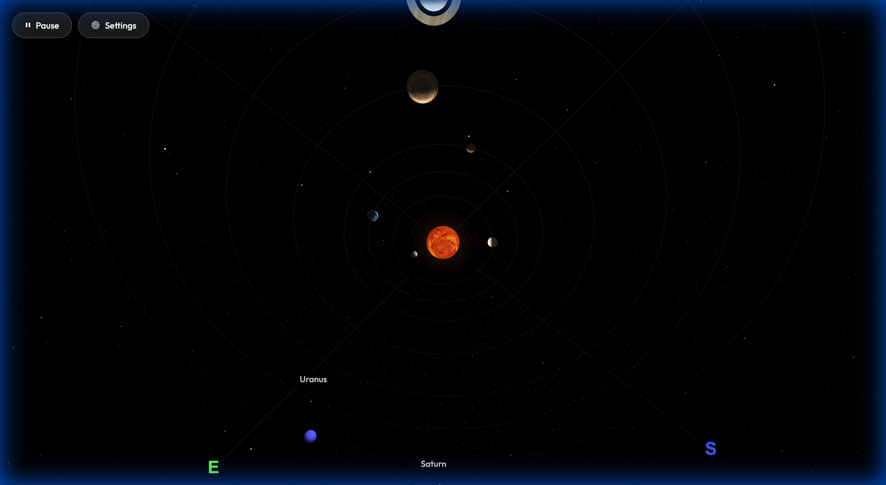
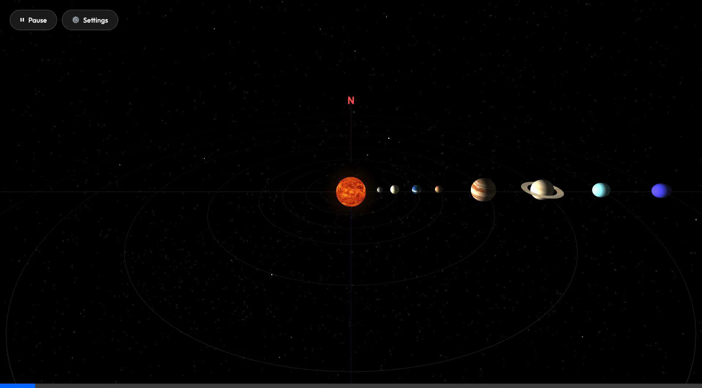

# Solar System Simulation Walkthrough

I have successfully upgraded the solar system simulation to a fully 3D experience using **Three.js**, added advanced UI controls, and implemented realistic orbital inclinations.

## Features
- **3D Visualization**: The Sun and planets are now 3D spheres.
- **Realistic Orbits**:
    - **Inclination**: Each planet orbits on a tilted plane relative to the ecliptic (Earth's orbit), based on real-world data (e.g., Mercury 7°).
    - **Textures**: Realistic textures applied to the Sun, Earth, Mars, Jupiter, Saturn, Mercury, and Venus.
- **Animation**: Planets orbit the Sun and rotate on their axes.
- **Interactive Controls**: 
    - **Play/Pause**: Control the animation.
    - **OrbitControls**: Click and drag to rotate the view, scroll to zoom.
    - **Settings Panel**: Adjust the rotation speed of each planet individually.
- **Navigation**:
    - **Compass**: N, S, E, W markers in 3D space.
    - **Labels**: Planet names are displayed next to the planets.

## Verification
I verified the simulation by running it in the browser.
- **Inclinations**: Orbits are clearly tilted when viewed from the side, especially Mercury's.
- **Settings**: The settings panel opens, and sliders correctly adjust planet rotation speeds.
- **Compass**: Direction markers are visible in the scene.
- **3D Scene**: Rendering and interaction work as expected.

### Orbital Inclination Verification

### UI & Compass Verification

### 3D Simulation Recording

## Files
- [index.html](index.html)
- [style.css](style.css)
- [script.js](script.js)
